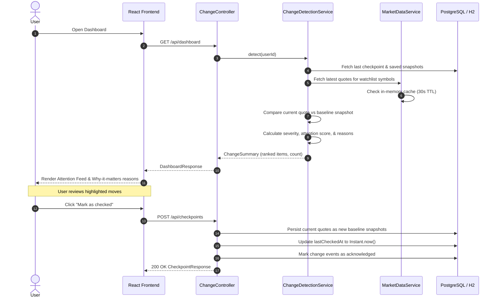

# MarketPulse — Smart Market Watchlist

> **Track → Remember → Compare → Explain → Prioritize**
>
> *Instead of dumping a price table, MarketPulse tells the user what meaningfully changed since their last check, ranked by an attention score, with clear explanations of why it matters.*

---

## 1. The Core Engineering Story

When presenting MarketPulse to engineering peers, the narrative is not *"I made a React website with Spring Boot."*

Instead:

> **"I treated the watchlist as a state-comparison problem.** The system persists a user's last meaningful checkpoint, obtains the latest market state, identifies significant changes using explainable rules, and prioritizes those changes by attention score. I intentionally used a **modular monolith** because the problem does not justify microservice complexity at this scale, while keeping external market data isolated behind an abstraction (`MarketDataProvider`) so providers can be swapped independently with zero impact on the change detection engine."

### The Problem We Solved
A conventional watchlist displays raw tickers and percentage moves (`AAPL $230.20 +0.8%`, `TSLA $340.10 -2.1%`, `NVDA $178.50 +1.4%`), forcing users to manually scan and deduce what matters.

MarketPulse introduces an **intelligence layer**:
- **What changed?** Evaluates movement relative to the user's *last meaningful check*, not just daily market open.
- **Why does it matter?** Transparent explanations (e.g., *"Move exceeds your 3% threshold"*, *"Unusually high volume (2.4× recent average)"*, *"Near today's day high"*).
- **What deserves attention?** Weighted attention score (0–100) sorting critical moves to the top.
- **Reliable Checkpoints:** The checkpoint updates **only** when the user explicitly clicks **"Mark as checked"** after reviewing changes, preventing transient network glitches or page refreshes from wiping previous state.

---

## 2. System Architecture

MarketPulse is structured as a **Modular Monolith** in Spring Boot 3.5.5 paired with a high-performance **React 19 + TypeScript** frontend.

### High-Level Architecture Diagram

```text
┌────────────────────────────────────────────────────────┐
│                   React 19 Frontend                    │
│   (TypeScript, Vite, Bootstrap, Context API, Axios)    │
└───────────────────────────┬────────────────────────────┘
                            │ REST APIs (Bearer JWT)
┌───────────────────────────▼────────────────────────────┐
│              Spring Boot Modular Monolith              │
│                                                        │
│  ┌──────────────────┐  ┌──────────────────┐            │
│  │   Auth Module    │  │ Watchlist Module │            │
│  │  (JWT + BCrypt)  │  │ (CRUD + Security)│            │
│  └─────────┬────────┘  └────────┬─────────┘            │
│            │                    │                      │
│  ┌─────────▼────────────────────▼─────────┐            │
│  │         Smart Change Engine            │            │
│  │  - Baseline State Comparison           │            │
│  │  - Attention Score (0-100)             │            │
│  │  - Explainable Reason Generator        │            │
│  └─────────────────┬──────────────────────┘            │
│                    │                                   │
│  ┌─────────────────▼──────────────────────┐            │
│  │          Market Data Module            │            │
│  │  - MarketDataProvider (Abstraction)    │            │
│  │  - In-Memory TTL Cache (30s)           │            │
│  │  - Graceful Stale & Failure Handling   │            │
│  └──────┬──────────────────────────┬──────┘            │
│         │                          │                   │
└─────────┼──────────────────────────┼───────────────────┘
          │                          │
┌─────────▼─────────┐      ┌─────────▼──────────────────┐
│ PostgreSQL / H2   │      │  External Market Provider  │
│ (JPA / Hibernate) │      │  (Mock / Finnhub API)      │
└───────────────────┘      └────────────────────────────┘
```

### Flow of Change Detection & Checkpoint



---

## 3. Key Architectural Trade-offs

Every technical decision in MarketPulse is justified by product context and engineering discipline:

| Decision | Alternative Considered | Engineering Justification |
| :--- | :--- | :--- |
| **Modular Monolith** | Microservices Architecture | A single deployable JAR eliminates distributed transaction overhead, service meshes, network serialization latency, and deployment complexity, while strict package isolation keeps code boundaries clean. |
| **PostgreSQL** | NoSQL / Document Store | Relational schema enforces referential integrity between users, watchlists, watchlist stocks, checkpoints, and market snapshots. ACID transactions ensure checkpoint updates and snapshot persistence succeed atomically. |
| **JWT Stateless Auth** | Stateful Session Cookies | Enables horizontally scalable, stateless REST communication without server session stores. Expiring tokens with cryptographic verification protect every endpoint. |
| **BCrypt Hashing** | Plaintext / MD5 / SHA-256 | Adaptive slow hashing with salt prevents rainbow table lookups and brute-force attacks on user credentials. |
| **Provider Abstraction** (`MarketDataProvider`) | Direct HTTP client in service | Decouples business logic from vendor APIs (rate limits, payload schemas, outages). System effortlessly switches between `MockMarketDataProvider` (for instant zero-dependency local dev/tests) and `FinnhubMarketDataProvider` via config. |
| **Rule-Based Change Engine** | Black-box Machine Learning | Financial explanations must be deterministic, explainable, and trustworthy. Users understand *"Volume is 2.4× recent average"*, whereas ML weights cannot explain themselves. |
| **Simple Attention Score** | Complex Statistical Models | Linear combination of move magnitude, volume spikes, and day high/low proximity produces an intuitive 0–100 score that ranks urgent items first. |
| **Database Persistence** | Browser `localStorage` | Critical state (last checked time, baseline snapshots) survives session clearing, browser restarts, and works across multiple user devices. |
| **Graceful Degradation** | 500 Internal Server Error | If one stock's API call fails or times out, that quote is flagged `UNAVAILABLE` while the rest of the watchlist renders seamlessly. |
| **Stale Data Tagging** | Pretending old data is live | If quote timestamp exceeds freshness threshold (15 mins), the UI explicitly marks it `STALE`. We never mislead users. |
| **No Redis Initially** | Redis Cache Layer | In-memory `ConcurrentHashMap` with 30s TTL satisfies single-node requirements with zero external infrastructure dependency. Redis can be slotted in behind the same service interface when multi-instance horizontal scaling requires it. |
| **Strict Authorization** | Query filtering only | Differentiates 404 (Resource Not Found) from 403 (Access Denied). When User B accesses User A's watchlist, the backend strictly rejects it with `403 Forbidden`. |

---

## 4. Attention Scoring & Explainability Engine

The attention score prioritizes which stocks demand immediate inspection:

$$\text{Attention Score} = \min(100, S_{\text{price}} + S_{\text{volume}} + S_{\text{extreme}} + S_{\text{time}})$$

- **Price Movement ($S_{\text{price}}$):**
  - $\ge 7\%$ move $\rightarrow +55$ pts (Critical)
  - $\ge 3\%$ move $\rightarrow +40$ pts (Significant)
  - $\ge 1.5\%$ move $\rightarrow +20$ pts (Notable)
  - Base move points: up to $+35$ pts scaled from absolute percentage change.
- **Volume Anomaly ($S_{\text{volume}}$):**
  - Volume $\ge 1.8\times$ baseline volume $\rightarrow +25$ pts.
- **Extreme Proximity ($S_{\text{extreme}}$):**
  - Current price within $1\%$ of Day High $\rightarrow +12$ pts (*"Near day high"*).
  - Current price within $1\%$ of Day Low $\rightarrow +12$ pts (*"Near day low"*).
- **Time Decay ($S_{\text{time}}$):**
  - Up to $+15$ pts added if the user has not checked for several hours.

### Explainability Output Example
```json
{
  "symbol": "NVDA",
  "companyName": "NVIDIA Corporation",
  "changeType": "PRICE_MOVEMENT",
  "severity": "SIGNIFICANT",
  "attentionScore": 87,
  "changePercent": -6.67,
  "reasons": [
    "NVDA price decreased 6.67% since your last check.",
    "Move exceeds your configured 3.00% threshold.",
    "Price is near today's low ($164.79)."
  ]
}
```

---

## 5. API Reference

All protected endpoints require `Authorization: Bearer <jwt_token>`.

| Method | Endpoint | Description | Request Body | Success Response | Error Codes |
| :--- | :--- | :--- | :--- | :--- | :--- |
| `GET` | `/api/health` | Service health status | *None* | `200 OK` `{"status":"UP"}` | — |
| `POST` | `/api/auth/register` | User registration | `RegisterRequest` | `201 Created` `{ token, user }` | `400`, `409` |
| `POST` | `/api/auth/login` | User authentication | `LoginRequest` | `200 OK` `{ token, user }` | `400`, `401` |
| `POST` | `/api/auth/logout` | User logout | *None* | `200 OK` | `401` |
| `GET` | `/api/watchlists` | List current user watchlists | *None* | `200 OK` `List<WatchlistResponse>` | `401` |
| `POST` | `/api/watchlists` | Create new watchlist | `WatchlistRequest` | `201 Created` `WatchlistResponse` | `400`, `401`, `409` |
| `GET` | `/api/watchlists/{id}` | Get watchlist details with live quotes | *None* | `200 OK` `WatchlistResponse` | `401`, `403`, `404` |
| `PUT` | `/api/watchlists/{id}` | Rename watchlist | `WatchlistRequest` | `200 OK` `WatchlistResponse` | `400`, `401`, `403`, `404`, `409` |
| `DELETE`| `/api/watchlists/{id}` | Delete watchlist | *None* | `204 No Content` | `401`, `403`, `404` |
| `POST` | `/api/watchlists/{id}/stocks` | Add stock symbol to watchlist | `AddStockRequest` | `200 OK` `WatchlistResponse` | `400`, `401`, `403`, `404`, `409` |
| `DELETE`| `/api/watchlists/{id}/stocks/{symbol}` | Remove stock symbol | *None* | `204 No Content` | `401`, `403`, `404` |
| `GET` | `/api/market/{symbol}` | Fetch market quote for symbol | *None* | `200 OK` `MarketQuoteDto` | `400`, `401` |
| `GET` | `/api/dashboard` | Aggregated dashboard view | *None* | `200 OK` `DashboardResponse` | `401` |
| `GET` | `/api/changes` | Change detection feed ranked by score | *None* | `200 OK` `ChangeSummaryDto` | `401` |
| `POST` | `/api/checkpoints` | Advance checkpoint & persist snapshots | *None* | `200 OK` `CheckpointResponse` | `401` |

---

## 6. Setup and Execution Guide

### Prerequisites
- **Java**: JDK 21+ (Tested and verified on OpenJDK 24)
- **Node.js**: v18+ with `npm`
- **Docker** (Optional, for running PostgreSQL container)

### Option A: Local Development (Default Zero-Config H2 + Mock Market Provider)

1. **Start Backend**:
   ```powershell
   cd backend
   $env:JAVA_HOME = "C:\Program Files\Java\jdk-24"
   .\mvnw.cmd spring-boot:run
   ```
   *Runs on port `8080` with in-memory H2 database and realistic mock market quotes.*

2. **Start Frontend**:
   ```powershell
   cd frontend
   npm install
   npm run dev
   ```
   *Runs on `http://localhost:5173` with Vite proxy forwarding `/api` to `localhost:8080`.*

### Option B: Production Mode with Docker & PostgreSQL

1. **Start PostgreSQL**:
   ```powershell
   docker-compose up -d
   ```
2. **Start Backend with PostgreSQL Profile**:
   ```powershell
   cd backend
   $env:SPRING_PROFILES_ACTIVE = "prod"
   $env:DB_URL = "jdbc:postgresql://localhost:5432/marketpulse"
   $env:DB_USERNAME = "marketpulse"
   $env:DB_PASSWORD = "pulsepassword"
   $env:JWT_SECRET = "super-secret-production-key-must-be-256-bits-long!!"
   .\mvnw.cmd spring-boot:run
   ```

### Optional: Connect Real Finnhub Market Data
Set environment variables:
```powershell
$env:MARKET_DATA_PROVIDER = "finnhub"
$env:MARKET_DATA_API_KEY = "your_finnhub_api_key_here"
```

---

## 7. Testing & Verification Suite

MarketPulse features a comprehensive test suite across backend and frontend:

### Backend Test Suite (JUnit 5 + MockMvc + Mockito)
Runs in `< 15 seconds`:
```powershell
$env:JAVA_HOME = "C:\Program Files\Java\jdk-24"
cd backend
.\mvnw.cmd clean test
```

**Coverage highlights (16 tests, 0 failures, 0 errors):**
- **`AuthAndHealthIntegrationTest`**:
  - `healthIsPublic` (200 OK with `{"status":"UP"}`)
  - `dashboardRequiresAuthentication` (401 Unauthorized)
  - `registerAndLoginReturnJwt` (201 Created, JWT token generation, duplicate email 409 rejection, bad credentials rejection)
  - `registerWithMismatchedPasswordsReturnsBadRequest` (400 Bad Request with validation message)
  - `registerWithInvalidFieldsReturnsValidationDetails` (400 Bad Request with field errors list)
- **`WatchlistIntegrationTest`**:
  - `testWatchlistCrudAndStockManagement` (Create, rename, add stocks, delete stock, delete watchlist)
  - `testDuplicateWatchlistNameRejected` (409 Conflict)
  - `testDuplicateStockInWatchlistRejected` (409 Conflict)
  - **`testDataOwnershipSecurityUserBCannotAccessUserAWatchlist`**: User A creates watchlist; User B authenticated attempts `GET`, `POST`, `PUT`, `DELETE` $\rightarrow$ strictly asserts **403 Forbidden**. Non-existent watchlist returns **404 Not Found**.
- **`MarketDataServiceTest`**:
  - `gracefulFailureWhenProviderThrowsException`: Returns `MarketStatus.UNAVAILABLE` without crashing or throwing 500.
  - `gracefulFailureWhenProviderReturnsEmpty`: Graceful fallback with descriptive status message.
  - `staleDataDetectedWhenCapturedAtExceedsFreshnessThreshold`: Quotes older than 15 minutes automatically converted to `MarketStatus.STALE`.
  - `cachingReusesQuoteWithinTtlWithoutRequeryingProvider`: Within 30s cache TTL, requests reuse cached quote without hitting external provider.
- **`ChangeDetectionIntegrationTest`**:
  - Baseline inference, change calculation against last check, checkpoint creation, snapshot persistence, and subsequent change detection against snapshot baseline.
- **`AttentionScoreCalculatorTest`**:
  - Anomaly scoring, severity classification, and reason generation.

### Frontend Test Suite (Vitest + React Testing Library)
```powershell
cd frontend
npm test
npm run build
```

**Coverage highlights (9 tests, 0 failures):**
- **`AuthContext.test.tsx`**: Login, logout, token persistence, and removal in `localStorage`.
- **`DashboardPage.test.tsx`**: Greeting display, last checked time, meaningful changes counter, attention cards with severity badges, score tags, explainable reasons, and "Mark as checked" checkpoint service integration.
- **`WatchlistPage.test.tsx`**: Watchlist list rendering, stock table with live price and status pills, and stock symbol addition.
- **`format.test.ts`**: Formatting utility calculations.

---

## 8. Git Strategy & Branch Organization

In adherence with the engineering challenge requirements (Blueprint §46–48):
- **Author convention**: `[Navya Raj] : description`
- **Main branches**: `main` (production-ready stable release) and `develop` (integration branch)
- **Use Case Feature Branches** (preserved and retained):
  - `feature/UC1-ProjectSetup`: Project initialization, health check, CORS, frontend skeleton
  - `feature/UC2-Authentication`: JWT stateless auth, BCrypt password hashing, registration & login validation
  - `feature/UC3-Watchlist`: Watchlist CRUD, stock management, strict data ownership authorization (403 vs 404)
  - `feature/UC4-MarketData`: `MarketDataProvider` abstraction, mock provider, caching, stale data detection, graceful degradation
  - `feature/UC5-ChangeDetection`: Smart change calculation, attention score algorithm, explainable reasons
  - `feature/UC6-SmartDashboard`: Prioritized attention cards, severity badges, greeting, watchlists overview
  - `feature/UC7-Checkpoint`: "Mark as checked" lifecycle, baseline snapshot persistence, end-to-end reliability
